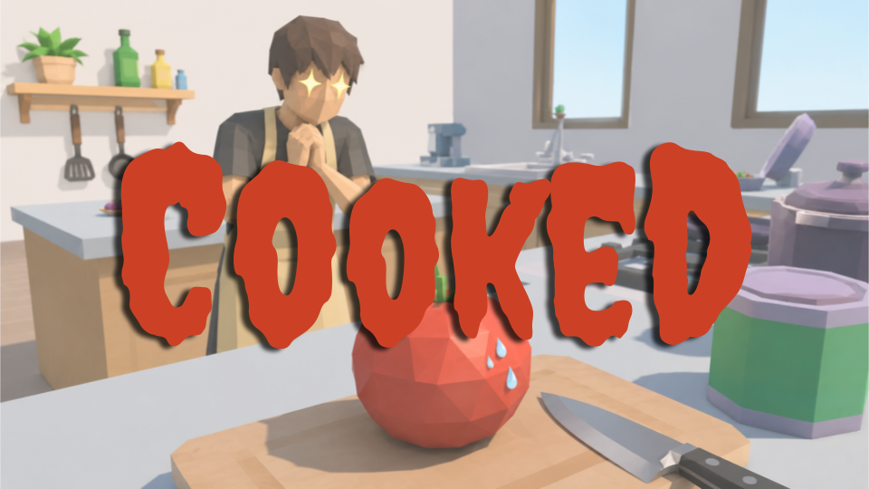

# Cooked 🍅

A silly little kitchen escape game made for **USYD GameJam 2026**.

The theme was **Flip the Script**, so instead of playing as the chef, you play as
the ingredient trying very hard not to become dinner.

You are a tomato. The kitchen is dangerous. The trash can is freedom.

## Play The Game

Cooked is available on:

- **Apple:** macOS builds for Intel 64-bit and Apple silicon
- **Windows:** Windows build for Intel
- **Web:** playable through the GitHub Pages website

**For the best experience, please use the downloadable executable/app builds,
especially on macOS.** The web version is convenient for quick testing, but the
WebGL build does not have good graphics compared with the native app versions.
Lighting, performance, and visual quality are much better in the actual
downloadable builds.

## macOS Security Note

If you are on Apple/macOS, the built app may be blocked the first time you open
it because it is not notarized through the App Store.

To run it:

1. Try opening the app once.
2. Open **System Settings**.
3. Go to **Privacy & Security**.
4. Scroll to the very bottom.
5. Authorize the blocked Cooked app.
6. Open the app again.

The game may also request input permissions. Please allow them so the controls
can be tested properly.

## How To Play

Click **Play** to start the game. After the intro camera shows the kitchen, roll
the tomato across the counter and try to reach the trash can before time runs
out.

You win by making it to the trash can.

You lose if:

- the timer runs out
- you fall off the counter
- the knife catches and chops you

## Controls

- `WASD` or arrow keys: move the tomato
- `Space`: jump
- Right mouse button + mouse movement: move the camera
- Any key after winning or losing: return to the start screen

## Tips

- Keep moving. The knife appears when the tomato is still or moving too slowly.
- Use the sponge when you get close to it. It can launch the tomato.
- The knife will not bother you while you are near the sponge or in the air.
- If the browser version feels slow or visually rough, switch to a native build.

## Known Web Version Limitations

The GitHub Pages version is a WebGL build. It is useful for accessibility and
quick sharing, but it is not the ideal way to experience the game.

Known web limitations:

- lower visual quality than native builds
- less reliable performance depending on browser and hardware
- possible browser audio/input permission quirks
- larger first load because the game assets download in the browser

For judging, testing, or recording gameplay, the macOS or Windows executable is
recommended.

## Project Structure

- `cooked/` contains the Unity project source.
- `out/` contains the GitHub Pages WebGL build.
- `.github/workflows/pages.yml` deploys the `out/` folder to GitHub Pages.

## Team

Made with care, chaos, and probably snacks by:

- Sindy
- Afia
- Qiuyue

## Credits

Created for the **USYD GameJam 2026** theme:

> Flip the Script

Asset credits:

- Kenney Food Kit, CC0
- Kenney Furniture Pack, CC0
